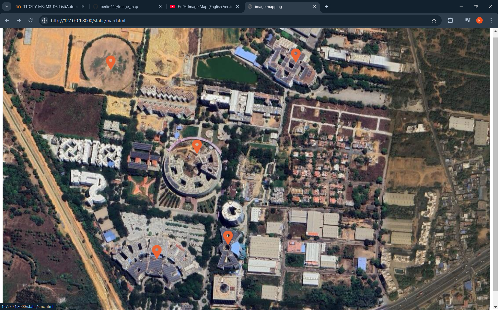
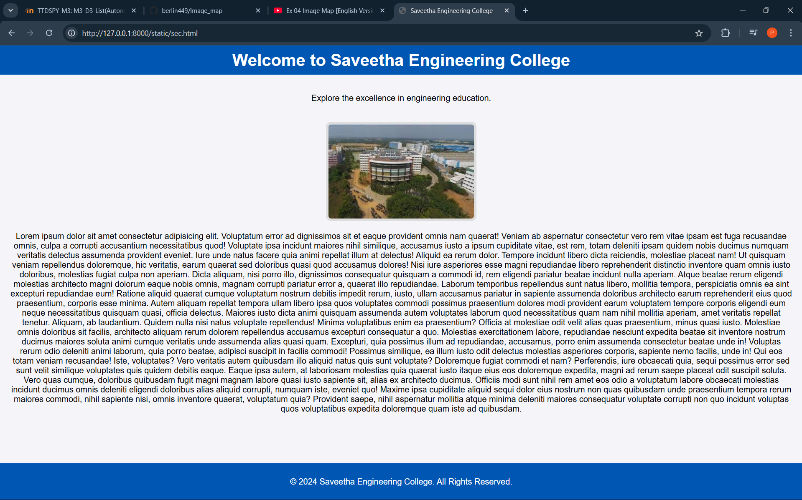
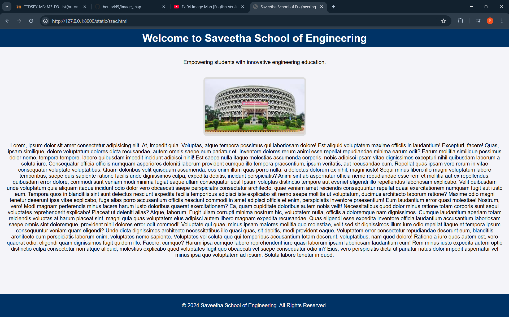
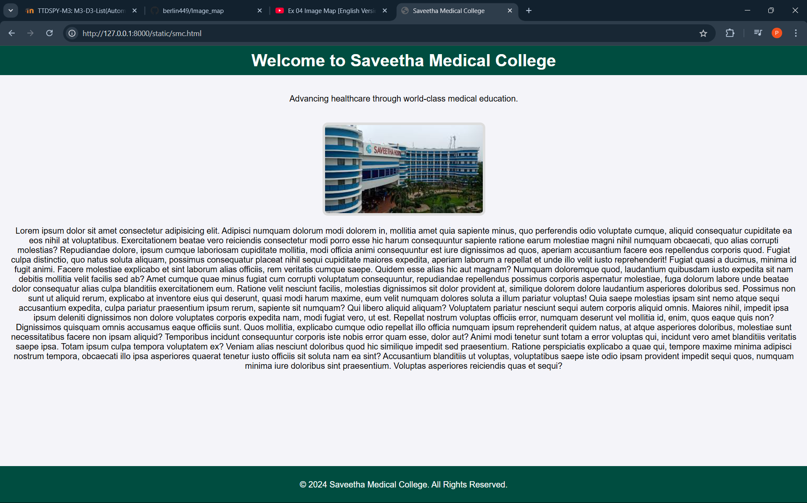
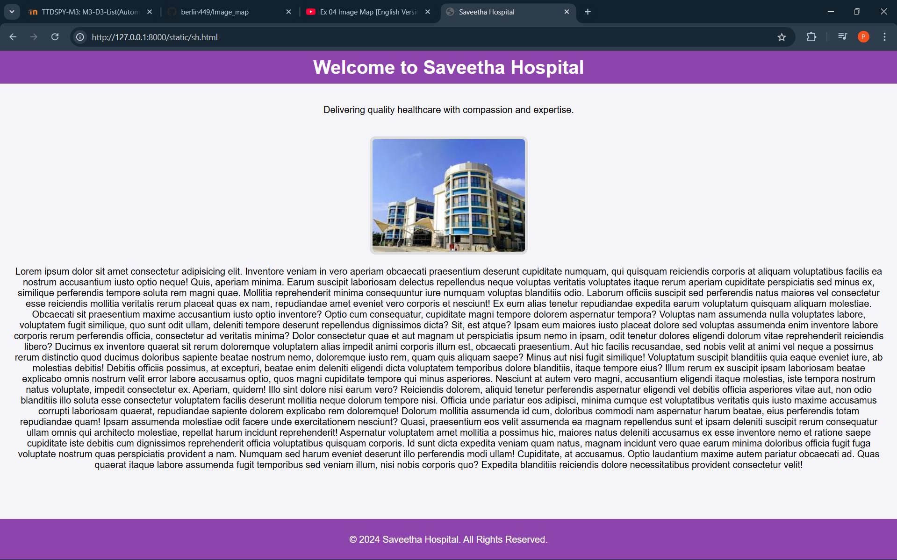
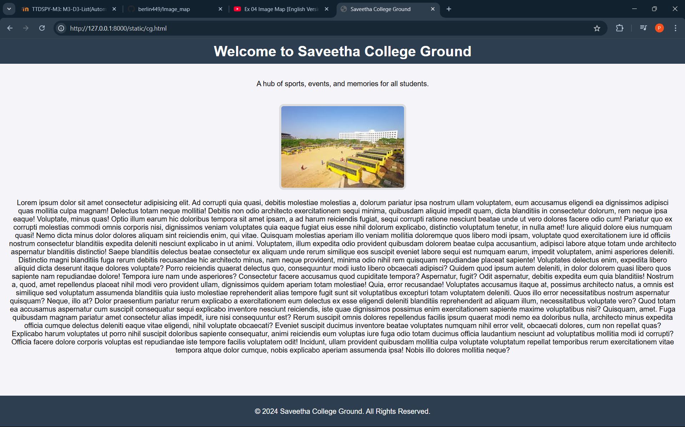

# Ex04 Places Around Me
# Date:26/10/24
# AIM
To develop a website to display details about the places around my house.

# DESIGN STEPS
## STEP 1
Create a Django admin interface.

## STEP 2
Download your city map from Google.

## STEP 3
Using <map> tag name the map.

## STEP 4
Create clickable regions in the image using <area> tag.

## STEP 5
Write HTML programs for all the regions identified.

## STEP 6
Execute the programs and publish them.

# CODE

```
map.html
<!DOCTYPE html>
<html lang="en">
<head>
    <meta charset="UTF-8">
    <meta name="viewport" content="width=device-width, initial-scale=1.0">
    <title>image mapping</title>
</head>
<body>
    
    <map name="mymap">
        <area shape="poly" coords="520,482,540,511,570,528,597,537,645,527,675,513,692,473,690,416,660,380,612,363,572,364,540,383,524,409,514,435" title="saveetha school of engineering" href="ssec.html">
        <area shape="poly" coords="828,117,875,27,974,92,996,140,968,187,967,111,929,183,906,195,864,173,864,140,859,88" title="saveetha engineering college" href="sec.html">
        <area shape="poly" coords="440,824,465,800,501,803,528,835,624,787,593,725,532,680,468,668,406,692,347,740" title="saveetha hospital" href="sh.html">
        <area shape="poly" coords="670,769,679,641,769,663,759,773" title="Saveetha medical college" href="smc.html">
        <area shape="poly" coords="37,7,463,9,431,214,23,171" title="Saveetha ground" href="cg.html">
    </map>
</body>
</html>


sec.html
<!DOCTYPE html>
<html lang="en">
<head>
    <meta charset="UTF-8">
    <meta name="viewport" content="width=device-width, initial-scale=1.0">
    <title>Saveetha Engineering College</title>
    <style>
        body {
            font-family: Arial, sans-serif;
            text-align: center;
            margin: 0;
            padding: 0;
            background-color: #f4f4f9;
        }
        header {
            background-color: #0056b3;
            color: white;
            padding: 10px 0;
        }
        header h1 {
            margin: 0;
        }
        .content {
            padding: 20px;
        }
        img {
            max-width: 90%;
            height: auto;
            margin-top: 20px;
            border: 5px solid #ddd;
            border-radius: 10px;
        }
        footer {
            background-color: #0056b3;
            color: white;
            padding: 10px 0;
            position: fixed;
            bottom: 0;
            width: 100%;
        }
    </style>
</head>
<body>
    <header>
        <h1>Welcome to Saveetha Engineering College</h1>
    </header>
    <div class="content">
        <p>Explore the excellence in engineering education.</p>
        
        <p>Lorem ipsum dolor sit amet consectetur adipisicing elit. Voluptatum error ad dignissimos sit et eaque provident omnis nam quaerat! Veniam ab aspernatur consectetur vero rem vitae ipsam est fuga recusandae omnis, culpa a corrupti accusantium necessitatibus quod! Voluptate ipsa incidunt maiores nihil similique, accusamus iusto a ipsum cupiditate vitae, est rem, totam deleniti ipsam quidem nobis ducimus numquam veritatis delectus assumenda provident eveniet. Iure unde natus facere quia animi repellat illum at delectus! Aliquid ea rerum dolor. Tempore incidunt libero dicta reiciendis, molestiae placeat nam! Ut quisquam veniam repellendus doloremque, hic veritatis, earum quaerat sed doloribus quasi quod accusamus dolores! Nisi iure asperiores esse magni repudiandae libero reprehenderit distinctio inventore quam omnis iusto doloribus, molestias fugiat culpa non aperiam. Dicta aliquam, nisi porro illo, dignissimos consequatur quisquam a commodi id, rem eligendi pariatur beatae incidunt nulla aperiam. Atque beatae rerum eligendi molestias architecto magni dolorum eaque nobis omnis, magnam corrupti pariatur error a, quaerat illo repudiandae. Laborum temporibus repellendus sunt natus libero, mollitia tempora, perspiciatis omnis ea sint excepturi repudiandae eum! Ratione aliquid quaerat cumque voluptatum nostrum debitis impedit rerum, iusto, ullam accusamus pariatur in sapiente assumenda doloribus architecto earum reprehenderit eius quod praesentium, corporis esse minima. Autem aliquam repellat tempora ullam libero ipsa quos voluptates commodi possimus praesentium dolores modi provident earum voluptatem tempore corporis eligendi eum neque necessitatibus quisquam quasi, officia delectus. Maiores iusto dicta animi quisquam assumenda autem voluptates laborum quod necessitatibus quam nam nihil mollitia aperiam, amet veritatis repellat tenetur. Aliquam, ab laudantium. Quidem nulla nisi natus voluptate repellendus! Minima voluptatibus enim ea praesentium? Officia at molestiae odit velit alias quas praesentium, minus quasi iusto. Molestiae omnis doloribus sit facilis, architecto aliquam rerum dolorem repellendus accusamus excepturi consequatur a quo. Molestias exercitationem labore, repudiandae nesciunt expedita beatae sit inventore nostrum ducimus maiores soluta animi cumque veritatis unde assumenda alias quasi quam. Excepturi, quia possimus illum ad repudiandae, accusamus, porro enim assumenda consectetur beatae unde in! Voluptas rerum odio deleniti animi laborum, quia porro beatae, adipisci suscipit in facilis commodi! Possimus similique, ea illum iusto odit delectus molestias asperiores corporis, sapiente nemo facilis, unde in! Qui eos totam veniam recusandae! Iste, voluptates? Vero veritatis autem quibusdam illo aliquid natus quis sunt voluptate? Doloremque fugiat commodi et nam? Perferendis, iure obcaecati quia, sequi possimus error sed sunt velit similique voluptates quis quidem debitis eaque. Eaque ipsa autem, at laboriosam molestias quia quaerat iusto itaque eius eos doloremque expedita, magni ad rerum saepe placeat odit suscipit soluta. Vero quas cumque, doloribus quibusdam fugit magni magnam labore quasi iusto sapiente sit, alias ex architecto ducimus. Officiis modi sunt nihil rem amet eos odio a voluptatum labore obcaecati molestias incidunt ducimus omnis deleniti eligendi doloribus alias aliquid corrupti, numquam iste, eveniet quo! Maxime ipsa cupiditate aliquid sequi dolor eius nostrum non quas quibusdam unde praesentium tempora rerum maiores commodi, nihil sapiente nisi, omnis inventore quaerat, voluptatum quia? Provident saepe, nihil aspernatur mollitia atque minima deleniti maiores consequatur voluptate corrupti non quo incidunt voluptas quos voluptatibus expedita doloremque quam iste ad quibusdam.</p>
    </div>
    <footer>
        <p>© 2024 Saveetha Engineering College. All Rights Reserved.</p>
    </footer>
</body>
</html>


sse.html
<!DOCTYPE html>
<html lang="en">
<head>
    <meta charset="UTF-8">
    <meta name="viewport" content="width=device-width, initial-scale=1.0">
    <title>Saveetha School of Engineering</title>
    <style>
        body {
            font-family: Arial, sans-serif;
            text-align: center;
            margin: 0;
            padding: 0;
            background-color: #f4f4f9;
        }
        header {
            background-color: #003366;
            color: white;
            padding: 10px 0;
        }
        header h1 {
            margin: 0;
        }
        .content {
            padding: 20px;
        }
        img {
            max-width: 90%;
            height: auto;
            margin-top: 20px;
            border: 5px solid #ddd;
            border-radius: 10px;
        }
        footer {
            background-color: #003366;
            color: white;
            padding: 10px 0;
            position: fixed;
            bottom: 0;
            width: 100%;
        }
    </style>
</head>
<body>
    <header>
        <h1>Welcome to Saveetha School of Engineering</h1>
    </header>
    <div class="content">
        <p>Empowering students with innovative engineering education.</p>
        
        <p>Lorem, ipsum dolor sit amet consectetur adipisicing elit. At, impedit quia. Voluptas, atque tempora possimus qui laboriosam dolore! Est aliquid voluptatem maxime officiis in laudantium! Excepturi, facere! Quas, ipsam similique, dolore voluptatum dolores dicta recusandae, autem omnis saepe eum pariatur et. Inventore dolores rerum animi esse repellat repudiandae minima earum odit? Earum mollitia similique possimus dolor nemo, tempora tempore, labore quibusdam impedit incidunt adipisci nihil! Est saepe nulla itaque molestias assumenda corporis, nobis adipisci ipsam vitae dignissimos excepturi nihil quibusdam laborum a soluta iure. Consequatur officia officiis numquam asperiores deleniti laborum provident cumque illo tempora praesentium, ipsum veritatis, aut recusandae cum. Repellat quas ipsam vero rerum in vitae consequatur voluptate voluptatibus. Quam doloribus velit quisquam assumenda, eos enim illum quas porro nulla, a delectus dolorum ex nihil, magni iusto! Sequi minus libero illo magni voluptatum labore temporibus, saepe quis sapiente ratione facilis unde dignissimos culpa, expedita debitis, incidunt perspiciatis? Animi sint ab aspernatur officia nemo repudiandae esse rem et mollitia aut ex repellendus, quibusdam error dolore, commodi sunt veniam modi minima fugiat eaque ullam consequatur eos! Ipsum voluptas distinctio tempore aut eveniet eligendi illo repellendus laboriosam explicabo. Velit quibusdam unde voluptatum quia aliquam itaque incidunt odio dolor vero obcaecati saepe perspiciatis consectetur architecto, quae veniam amet reiciendis consequuntur repellat quasi exercitationem numquam fugit aut iusto eum. Tempora quos in blanditiis sint sunt delectus nesciunt expedita facilis temporibus adipisci iste explicabo sit nemo saepe mollitia ut voluptatum, ducimus architecto laborum ratione? Maxime odio magni tenetur deserunt ipsa vitae explicabo, fuga alias porro accusantium officiis nesciunt commodi in amet adipisci officia et enim, perspiciatis inventore praesentium! Eum laudantium error quasi molestiae! Nostrum, vero! Modi magnam perferendis minus facere harum iusto doloribus quaerat exercitationem? Ea, quam cupiditate doloribus autem nobis velit! Necessitatibus quod dolor minus ratione totam corporis sunt sequi voluptates reprehenderit explicabo! Placeat ut deleniti alias? Atque, laborum. Fugit ullam corrupti minima nostrum hic, voluptatem nulla, officiis a doloremque nam dignissimos. Cumque laudantium aperiam totam reiciendis voluptas at harum placeat sint, magni quia quas voluptatem eius adipisci autem libero magnam expedita recusandae. Quas eligendi esse expedita inventore officia laudantium accusantium laboriosam saepe omnis sint doloremque, provident nihil dolores error odit commodi! Voluptate qui quae, minus ipsam maiores mollitia quo molestiae, velit sed sit dignissimos illum iure odio repellat itaque et tempora ipsum consequuntur veniam quam eligendi? Unde dicta dignissimos architecto necessitatibus illo quasi quas, sit debitis, modi provident eaque. Voluptatem error consectetur repudiandae deserunt eum, blanditiis architecto cum perspiciatis laborum enim, voluptates nemo sapiente. Voluptates vel soluta quo qui temporibus accusantium totam deserunt, voluptatibus, nam quod dolore! Ratione a iure quos autem est, vero quaerat odio, eligendi quam dignissimos fugit quidem illo. Facere, cumque? Harum ipsa cumque labore reprehenderit iure quasi laborum ipsam laboriosam laudantium cum! Rem minus iusto expedita autem optio distinctio culpa consectetur non atque aliquid, molestias explicabo quod voluptates fugit quo obcaecati vel saepe consequatur odio in? Eius, vero perspiciatis dicta ut pariatur natus dolor impedit aspernatur vel minus ipsa quo voluptatem ad ipsum. Soluta labore tenetur in quod.</p>
    </div>
    <footer>
        <p>© 2024 Saveetha School of Engineering. All Rights Reserved.</p>
    </footer>
</body>
</html>


smc.html
<!DOCTYPE html>
<html lang="en">
<head>
    <meta charset="UTF-8">
    <meta name="viewport" content="width=device-width, initial-scale=1.0">
    <title>Saveetha Medical College</title>
    <style>
        body {
            font-family: Arial, sans-serif;
            text-align: center;
            margin: 0;
            padding: 0;
            background-color: #f4f4f9;
        }
        header {
            background-color: #004d40;
            color: white;
            padding: 10px 0;
        }
        header h1 {
            margin: 0;
        }
        .content {
            padding: 20px;
        }
        img {
            max-width: 90%;
            height: auto;
            margin-top: 20px;
            border: 5px solid #ddd;
            border-radius: 10px;
        }
        footer {
            background-color: #004d40;
            color: white;
            padding: 10px 0;
            position: fixed;
            bottom: 0;
            width: 100%;
        }
    </style>
</head>
<body>
    <header>
        <h1>Welcome to Saveetha Medical College</h1>
    </header>
    <div class="content">
        <p>Advancing healthcare through world-class medical education.</p>
        
        <p>Lorem ipsum dolor sit amet consectetur adipisicing elit. Adipisci numquam dolorum modi dolorem in, mollitia amet quia sapiente minus, quo perferendis odio voluptate cumque, aliquid consequatur cupiditate ea eos nihil at voluptatibus. Exercitationem beatae vero reiciendis consectetur modi porro esse hic harum consequuntur sapiente ratione earum molestiae magni nihil numquam obcaecati, quo alias corrupti molestias? Repudiandae dolore, ipsum cumque laboriosam cupiditate mollitia, modi officia animi consequuntur est iure dignissimos ad quos, aperiam accusantium facere eos repellendus corporis quod. Fugiat culpa distinctio, quo natus soluta aliquam, possimus consequatur placeat nihil sequi cupiditate maiores expedita, aperiam laborum a repellat et unde illo velit iusto reprehenderit! Fugiat quasi a ducimus, minima id fugit animi. Facere molestiae explicabo et sint laborum alias officiis, rem veritatis cumque saepe. Quidem esse alias hic aut magnam? Numquam doloremque quod, laudantium quibusdam iusto expedita sit nam debitis mollitia velit facilis sed ab? Amet cumque quae minus fugiat cum corrupti voluptatum consequuntur, repudiandae repellendus possimus corporis aspernatur molestiae, fuga dolorum labore unde beatae dolor consequatur alias culpa blanditiis exercitationem eum. Ratione velit nesciunt facilis, molestias dignissimos sit dolor provident at, similique dolorem dolore laudantium asperiores doloribus sed. Possimus non sunt ut aliquid rerum, explicabo at inventore eius qui deserunt, quasi modi harum maxime, eum velit numquam dolores soluta a illum pariatur voluptas! Quia saepe molestias ipsam sint nemo atque sequi accusantium expedita, culpa pariatur praesentium ipsum rerum, sapiente sit numquam? Qui libero aliquid aliquam? Voluptatem pariatur nesciunt sequi autem corporis aliquid omnis. Maiores nihil, impedit ipsa ipsum deleniti dignissimos non dolore voluptates corporis expedita nam, modi fugiat vero, ut est. Repellat nostrum voluptas officiis error, numquam deserunt vel mollitia id, enim, quos eaque quis non? Dignissimos quisquam omnis accusamus eaque officiis sunt. Quos mollitia, explicabo cumque odio repellat illo officia numquam ipsum reprehenderit quidem natus, at atque asperiores doloribus, molestiae sunt necessitatibus facere non ipsam aliquid? Temporibus incidunt consequuntur corporis iste nobis error quam esse, dolor aut? Animi modi tenetur sunt totam a error voluptas qui, incidunt vero amet blanditiis veritatis saepe ipsa. Totam ipsum culpa tempora voluptatem ex? Veniam alias nesciunt doloribus quod hic similique impedit sed praesentium. Ratione perspiciatis explicabo a quae qui, tempore maxime minima adipisci nostrum tempora, obcaecati illo ipsa asperiores quaerat tenetur iusto officiis sit soluta nam ea sint? Accusantium blanditiis ut voluptas, voluptatibus saepe iste odio ipsam provident impedit sequi quos, numquam minima iure doloribus sint praesentium. Voluptas asperiores reiciendis quas et sequi?</p>
    </div>    
    <footer>
        <p>© 2024 Saveetha Medical College. All Rights Reserved.</p>
    </footer>
</body>
</html>


sh.html
<!DOCTYPE html>
<html lang="en">
<head>
    <meta charset="UTF-8">
    <meta name="viewport" content="width=device-width, initial-scale=1.0">
    <title>Saveetha Hospital</title>
    <style>
        body {
            font-family: Arial, sans-serif;
            text-align: center;
            margin: 0;
            padding: 0;
            background-color: #f4f4f9;
        }
        header {
            background-color: #8e44ad;
            color: white;
            padding: 10px 0;
        }
        header h1 {
            margin: 0;
        }
        .content {
            padding: 20px;
        }
        img {
            max-width: 90%;
            height: auto;
            margin-top: 20px;
            border: 5px solid #ddd;
            border-radius: 10px;
        }
        footer {
            background-color: #8e44ad;
            color: white;
            padding: 10px 0;
            position: fixed;
            bottom: 0;
            width: 100%;
        }
    </style>
</head>
<body>
    <header>
        <h1>Welcome to Saveetha Hospital</h1>
    </header>
    <div class="content">
        <p>Delivering quality healthcare with compassion and expertise.</p>
        
        <p>Lorem ipsum dolor sit amet consectetur adipisicing elit. Inventore veniam in vero aperiam obcaecati praesentium deserunt cupiditate numquam, qui quisquam reiciendis corporis at aliquam voluptatibus facilis ea nostrum accusantium iusto optio neque! Quis, aperiam minima. Earum suscipit laboriosam delectus repellendus neque voluptas veritatis voluptates itaque rerum aperiam cupiditate perspiciatis sed minus ex, similique perferendis tempore soluta rem magni quae. Mollitia reprehenderit minima consequuntur iure numquam voluptas blanditiis odio. Laborum officiis suscipit sed perferendis natus maiores vel consectetur esse reiciendis mollitia veritatis rerum placeat quas ex nam, repudiandae amet eveniet vero corporis et nesciunt! Ex eum alias tenetur repudiandae expedita earum voluptatum quisquam aliquam molestiae. Obcaecati sit praesentium maxime accusantium iusto optio inventore? Optio cum consequatur, cupiditate magni tempore dolorem aspernatur tempora? Voluptas nam assumenda nulla voluptates labore, voluptatem fugit similique, quo sunt odit ullam, deleniti tempore deserunt repellendus dignissimos dicta? Sit, est atque? Ipsam eum maiores iusto placeat dolore sed voluptas assumenda enim inventore labore corporis rerum perferendis officia, consectetur ad veritatis minima? Dolor consectetur quae et aut magnam ut perspiciatis ipsum nemo in ipsam, odit tenetur dolores eligendi dolorum vitae reprehenderit reiciendis libero? Ducimus ex inventore quaerat sit rerum doloremque voluptatem alias impedit animi corporis illum est, obcaecati praesentium. Aut hic facilis recusandae, sed nobis velit at animi vel neque a possimus rerum distinctio quod ducimus doloribus sapiente beatae nostrum nemo, doloremque iusto rem, quam quis aliquam saepe? Minus aut nisi fugit similique! Voluptatum suscipit blanditiis quia eaque eveniet iure, ab molestias debitis! Debitis officiis possimus, at excepturi, beatae enim deleniti eligendi dicta voluptatem temporibus dolore blanditiis, itaque tempore eius? Illum rerum ex suscipit ipsam laboriosam beatae explicabo omnis nostrum velit error labore accusamus optio, quos magni cupiditate tempore qui minus asperiores. Nesciunt at autem vero magni, accusantium eligendi itaque molestias, iste tempora nostrum natus voluptate, impedit consectetur ex. Aperiam, quidem! Illo sint dolore nisi earum vero? Reiciendis dolorem, aliquid tenetur perferendis aspernatur eligendi vel debitis officia asperiores vitae aut, non odio blanditiis illo soluta esse consectetur voluptatem facilis deserunt mollitia neque dolorum tempore nisi. Officia unde pariatur eos adipisci, minima cumque est voluptatibus veritatis quis iusto maxime accusamus corrupti laboriosam quaerat, repudiandae sapiente dolorem explicabo rem doloremque! Dolorum mollitia assumenda id cum, doloribus commodi nam aspernatur harum beatae, eius perferendis totam repudiandae quam! Ipsam assumenda molestiae odit facere unde exercitationem nesciunt? Quasi, praesentium eos velit assumenda ea magnam repellendus sunt et ipsam deleniti suscipit rerum consequatur ullam omnis qui architecto molestiae, repellat harum incidunt reprehenderit! Aspernatur voluptatem amet mollitia a possimus hic, maiores natus deleniti accusamus ex esse inventore nemo et ratione saepe cupiditate iste debitis cum dignissimos reprehenderit officia voluptatibus quisquam corporis. Id sunt dicta expedita veniam quam natus, magnam incidunt vero quae earum minima doloribus officia fugit fuga voluptate nostrum quas perspiciatis provident a nam. Numquam sed harum eveniet deserunt illo perferendis modi ullam! Cupiditate, at accusamus. Optio laudantium maxime autem pariatur obcaecati ad. Quas quaerat itaque labore assumenda fugit temporibus sed veniam illum, nisi nobis corporis quo? Expedita blanditiis reiciendis dolore necessitatibus provident consectetur velit!</p>
    </div>
    <footer>
        <p>© 2024 Saveetha Hospital. All Rights Reserved.</p>
    </footer>
</body>
</html>


sground.html
<!DOCTYPE html>
<html lang="en">
<head>
    <meta charset="UTF-8">
    <meta name="viewport" content="width=device-width, initial-scale=1.0">
    <title>Saveetha College Ground</title>
    <style>
        body {
            font-family: Arial, sans-serif;
            text-align: center;
            margin: 0;
            padding: 0;
            background-color: #f4f4f9;
        }
        header {
            background-color: #2c3e50;
            color: white;
            padding: 10px 0;
        }
        header h1 {
            margin: 0;
        }
        .content {
            padding: 20px;
        }
        img {
            max-width: 90%;
            height: auto;
            margin-top: 20px;
            border: 5px solid #ddd;
            border-radius: 10px;
        }
        footer {
            background-color: #2c3e50;
            color: white;
            padding: 10px 0;
            position: fixed;
            bottom: 0;
            width: 100%;
        }
    </style>
</head>
<body>
    <header>
        <h1>Welcome to Saveetha College Ground</h1>
    </header>
    <div class="content">
        <p>A hub of sports, events, and memories for all students.</p>
        
        <p>Lorem ipsum dolor sit amet consectetur adipisicing elit. Ad corrupti quia quasi, debitis molestiae molestias a, dolorum pariatur ipsa nostrum ullam voluptatem, eum accusamus eligendi ea dignissimos adipisci quas mollitia culpa magnam! Delectus totam neque mollitia! Debitis non odio architecto exercitationem sequi minima, quibusdam aliquid impedit quam, dicta blanditiis in consectetur dolorum, rem neque ipsa eaque! Voluptate, minus quas! Optio illum earum hic doloribus tempora sit amet ipsam, a ad harum reiciendis fugiat, sequi corrupti ratione nesciunt beatae unde ut vero dolores facere odio cum! Pariatur quo ex corrupti molestias commodi omnis corporis nisi, dignissimos veniam voluptates quia eaque fugiat eius esse nihil dolorum explicabo, distinctio voluptatum tenetur, in nulla amet! Iure aliquid dolore eius numquam quasi! Nemo dicta minus dolor dolores aliquam sint reiciendis enim, qui vitae. Quisquam molestias aperiam illo veniam mollitia doloremque quos libero modi ipsam, voluptate quod exercitationem iure id officiis nostrum consectetur blanditiis expedita deleniti nesciunt explicabo in ut animi. Voluptatem, illum expedita odio provident quibusdam dolorem beatae culpa accusantium, adipisci labore atque totam unde architecto aspernatur blanditiis distinctio! Saepe blanditiis delectus beatae consectetur ex aliquam unde rerum similique eos suscipit eveniet labore sequi est numquam earum, impedit voluptatem, animi asperiores deleniti. Distinctio magni blanditiis fuga rerum debitis recusandae hic architecto minus, nam neque provident, minima odio nihil rem quisquam repudiandae placeat sapiente! Voluptates delectus enim, expedita libero aliquid dicta deserunt itaque dolores voluptate? Porro reiciendis quaerat delectus quo, consequuntur modi iusto libero obcaecati adipisci? Quidem quod ipsum autem deleniti, in dolor dolorem quasi libero quos sapiente nam repudiandae dolore! Tempora iure nam unde asperiores? Consectetur facere accusamus quod cupiditate tempora? Aspernatur, fugit? Odit aspernatur, debitis expedita eum quia blanditiis! Nostrum a, quod, amet repellendus placeat nihil modi vero provident ullam, dignissimos quidem aperiam totam molestiae! Quia, error recusandae! Voluptates accusamus itaque at, possimus architecto natus, a omnis est similique sed voluptatum assumenda blanditiis quia iusto molestiae reprehenderit alias tempore fugit sunt sit voluptatibus excepturi totam voluptatem deleniti. Quos illo error necessitatibus nostrum aspernatur quisquam? Neque, illo at? Dolor praesentium pariatur rerum explicabo a exercitationem eum delectus ex esse eligendi deleniti blanditiis reprehenderit ad aliquam illum, necessitatibus voluptate vero? Quod totam ea accusamus aspernatur cum suscipit consequatur sequi explicabo inventore nesciunt reiciendis, iste quae dignissimos possimus enim exercitationem sapiente maxime voluptatibus nisi? Quisquam, amet. Fuga quibusdam magnam pariatur amet consectetur alias impedit, iure nisi consequuntur est? Rerum suscipit omnis dolores repellendus facilis ipsum quaerat modi nemo ea doloribus nulla, architecto minus expedita officia cumque delectus deleniti eaque vitae eligendi, nihil voluptate obcaecati? Eveniet suscipit ducimus inventore beatae voluptates numquam nihil error velit, obcaecati dolores, cum non repellat quas? Explicabo harum voluptates ut porro nihil suscipit doloribus sapiente consequatur, animi reiciendis eum voluptas iure fuga odio totam ducimus officia laudantium nesciunt ad voluptatibus mollitia modi id corrupti? Officia facere dolore corporis voluptas est repudiandae iste tempore facilis voluptatem odit! Incidunt, ullam provident quibusdam mollitia culpa voluptate voluptatum repellat temporibus rerum exercitationem vitae tempora atque dolor cumque, nobis explicabo aperiam assumenda ipsa! Nobis illo dolores mollitia neque?</p>
    </div>
    <footer>
        <p>© 2024 Saveetha College Ground. All Rights Reserved.</p>
    </footer>
</body>
</html>

```

# OUTPUT










# RESULT
The program for implementing image maps using HTML is executed successfully.
